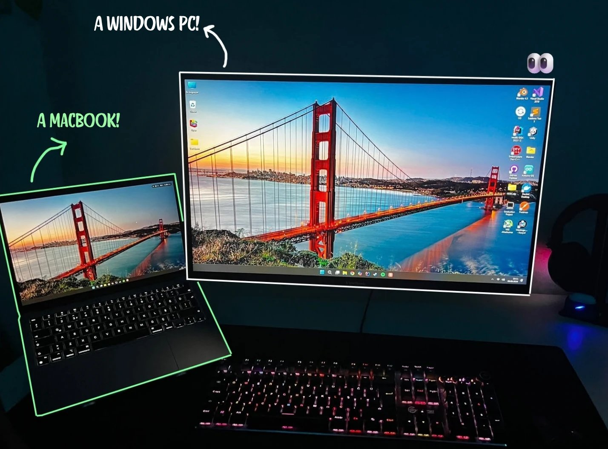
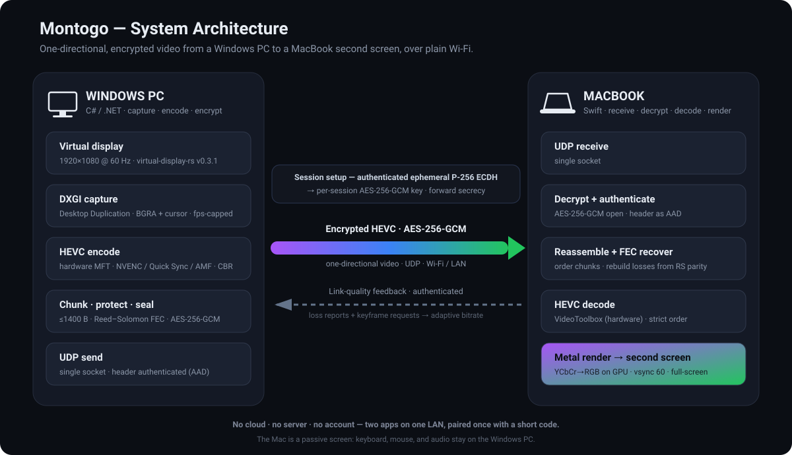

# Montogo

**Turn a MacBook into a wireless second monitor for a Windows PC — over plain Wi-Fi, no cables, no capture card, no extra hardware.**



Windows creates a virtual 1080p60 display, captures it, hardware-encodes it as **HEVC (H.265)**, encrypts every packet, and streams it over UDP to the Mac, which decrypts, hardware-decodes, and renders it full-screen with Metal. The link is one-directional — Windows sends pixels, the Mac is a passive screen. Keyboard, mouse, and **audio stay on Windows**: only video is streamed.



> 🔍 **How it works, in depth** — the frame pipeline, the security handshake, and the adaptive-bitrate control loop, all with diagrams: **[docs/DESIGN.md](docs/DESIGN.md)**.

---

## Highlights

- **HEVC (H.265), hardware end-to-end** — NVENC/Quick Sync/AMF encode on Windows, VideoToolbox decode on the Mac. ~2× the efficiency of H.264, so more picture fits a Wi-Fi link.
- **Low latency by design** — synchronous decode, vsync rendering, and adaptive pacing keep it responsive on a healthy Wi-Fi link.
- **Encrypted & authenticated** — AES-256-GCM on every packet, an authenticated ephemeral-ECDH handshake, and **forward secrecy** (see [DESIGN.md](docs/DESIGN.md#security)).
- **Adapts to the link** — the bitrate learns your Wi-Fi's real capacity and rides it; a lost frame re-syncs in ~1 round-trip instead of freezing for a second.
- **Zero cloud** — no server, no account, no pairing service. Two apps on one LAN and a short code you type once.

---

## Install

Two ways: grab a ready-made installer (most people), or build from source (developers).

### Installers (recommended)

Download the latest from the **[Releases page](https://github.com/iilke/Montogo/releases/latest)**:

- **Windows** — [`MontogoSetup.exe`](https://github.com/iilke/Montogo/releases/latest/download/MontogoSetup.exe). Run it; approve one SmartScreen warning (*More info → Run anyway* — it's unsigned) and one UAC prompt. It bundles the app **and** the virtual-display driver, so there's **no separate .NET or driver install**.
- **Mac** — [`Montogo.dmg`](https://github.com/iilke/Montogo/releases/latest/download/Montogo.dmg). Open it, drag **Montogo.app** onto **Applications**. First launch: **right-click → Open → Open** (unsigned), then allow **Local Network** when asked.

Then jump to [First connection](#first-connection).

### Build from source (developers)

Needs the [.NET 8 SDK](https://dotnet.microsoft.com/download) (or newer) on Windows and Xcode on the Mac.

**Windows**
1. Install the **virtual-display-rs v0.3.1** driver: download `virtual-desktop-driver-installer-x64.zip` from the [v0.3.1 release](https://github.com/MolotovCherry/virtual-display-rs/releases/tag/v0.3.1), extract it, run `install-cert.bat`, then run the MSI.
2. Run a **Release** build (Debug is too slow for real-time video):
   ```bash
   dotnet run -c Release --project windows/Montogo.App
   ```
   Montogo lives in the system tray and shows a **13-character connection code** and your **LAN IP**.
   > First launch shows one UAC prompt — the driver's control pipe is admin-only, so a tiny elevated helper creates the virtual display; the main app itself stays non-admin.

**Mac**
- Open `mac/Montogo/Montogo.xcodeproj` in Xcode and Run (**⌘R**) — or build a distributable `.dmg` with `installer/mac/build-dmg.sh`.

### First connection

1. Read the **code** and **LAN IP** from the Windows tray.
2. Enter both on the Mac and tap **Connect**. The stream starts once the handshake completes; **⌃⌘F** for full screen.
3. In Windows **Display settings**, extend your desktop onto the new virtual display and drag windows onto it.

The Mac remembers the pairing (code in the Keychain, IP in preferences) and auto-reconnects on later launches. Rotate the secret any time with **Reset connection code** in the tray.

---

## Requirements

- **Windows 10 or 11** with a GPU that has a **hardware HEVC encoder** (NVIDIA NVENC, Intel Quick Sync, or AMD AMF) — required; there is no software fallback.
- **macOS 13 (Ventura) or newer** — any modern Mac has a VideoToolbox HEVC decoder.
- Both machines on the **same Wi-Fi / LAN**, able to reach each other directly (guest networks and AP/client isolation will block it). **5 GHz is strongly recommended** — a stable, higher-capacity link is the single biggest factor in picture quality and smoothness.

---

## Limitations

- **Manual IP entry** — no service discovery yet; you type the PC's LAN IP once (a DHCP reservation keeps it stable).
- **Fixed 1920×1080** — not yet configurable.
- **One Mac and one Windows instance** at a time.
- **Hardware HEVC required on Windows** — no software-encoder fallback.
- **Built for a trusted LAN** — designed for a home/office network, not for direct exposure to the open internet (no NAT traversal or discovery).

---

## Tech stack

| | Windows | Mac |
|---|---|---|
| Language | C# / .NET 8 | Swift / SwiftUI |
| Role | capture · encode · encrypt · send | receive · decrypt · decode · render |
| Native APIs | DXGI, Direct3D 11, Media Foundation (via CsWin32) | Darwin sockets, VideoToolbox, Metal, CryptoKit |
| Codec | HEVC (H.265), hardware MFT | HEVC, VideoToolbox |
| Crypto | AES-256-GCM, HKDF, HMAC, P-256 ECDH | same (CryptoKit) |

The two apps share **no code** — only the wire protocol in [`PROTOCOL.md`](windows/Montogo.Protocol/PROTOCOL.md), which each implements natively. Full architecture and internals: **[docs/DESIGN.md](docs/DESIGN.md)**.
