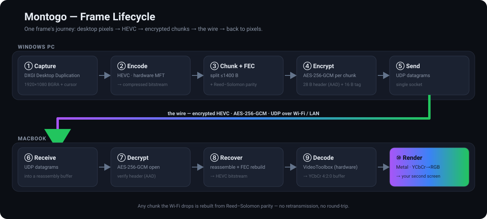
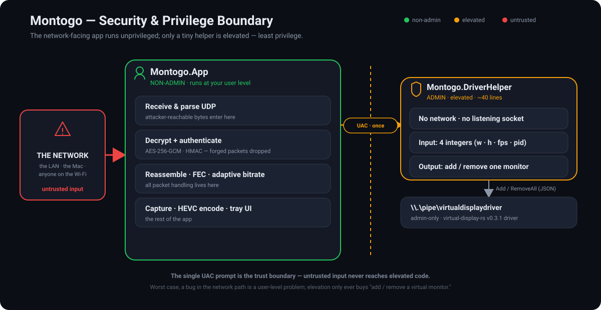

# Montogo — Design & Internals

How Montogo turns a Windows desktop into an encrypted video stream that a Mac renders as a
second screen. This is the deep dive; the [README](../README.md) has the overview and install
steps, and [`PROTOCOL.md`](../windows/Montogo.Protocol/PROTOCOL.md) has the exact wire format
(protocol v9).

---

## System architecture

Windows creates a virtual 1080p60 display, captures it, hardware-encodes it as **HEVC
(H.265)**, encrypts every video packet, and streams it over UDP to the Mac, which decrypts,
hardware-decodes, and renders it full-screen with Metal. The link is one-directional — Windows
sends pixels, the Mac is a passive screen. Keyboard, mouse, and **audio stay on Windows**.

The two apps share **no code** — only the wire protocol, which each implements natively (C# on
Windows, Swift on the Mac).

---

## Frame lifecycle

One frame's journey from the Windows desktop to the Mac screen:

1. **Virtual display** — there's no physical second monitor, so Montogo creates one with the [virtual-display-rs](https://github.com/MolotovCherry/virtual-display-rs) driver. Windows sees a real 1920×1080 @ 60 Hz output.
2. **Capture** — DXGI Desktop Duplication grabs the frame and composites the cursor. On a static desktop the last frame is re-emitted at the target fps so the stream never stalls; capture is rate-capped so fast motion can't flood the encoder.
3. **Encode** — a Media Foundation HEVC MFT (the GPU's hardware encoder) encodes the raw DXGI bytes directly, in CBR with a tight buffer so each frame fits the bitrate budget.
4. **Transport** — each frame is split into ≤1400-byte chunks, protected with Reed–Solomon FEC parity, and AES-256-GCM-encrypted per chunk (the chunk header is authenticated too). Everything goes over a single UDP port.
5. **Receive & decode** — the Mac reassembles chunks (rebuilding any lost by Wi-Fi from FEC), decrypts, and feeds VideoToolbox's hardware HEVC decoder in strict order.
6. **Render** — decoded frames go straight to a Metal view; the fragment shader does YCbCr→RGB on the GPU.

---

## Security

Montogo runs on your local network, and the link is hardened with modern cryptography — an
authenticated ephemeral key exchange, forward secrecy, and AES-256-GCM on every video
packet (the handshake and link feedback are authenticated with HMAC, not encrypted).

- **Pairing code** — a 13-character code (64-bit secret, e.g. `7X4K-9M2P-QRST`) shown on Windows and typed on the Mac once. It only **authenticates** the handshake; it never encrypts the video directly.
- **Ephemeral key exchange** — every session runs an authenticated **P-256 ECDH** exchange; the AES-256-GCM video key comes from that shared secret, not the code. This gives **forward secrecy**: traffic captured today can't be decrypted later even if the code leaks, and a passive eavesdropper can't recover the key at all.
- **Authenticated everything** — both handshake messages are HMAC-SHA256-authenticated (so a spoofed or replayed handshake is useless), and every video chunk is AES-256-GCM sealed with its header authenticated as associated data (so routing/reassembly fields can't be tampered with undetected).
- **At rest** — the code is stored encrypted: Windows DPAPI (current-user) and the macOS Keychain. It can be rotated from the Windows tray.
- **Least privilege** — the network-facing app runs unprivileged; only a tiny, network-free helper is elevated (just to control the display driver), so a flaw in the packet-handling path can't exceed your own user rights.

> See [`PROTOCOL.md`](../windows/Montogo.Protocol/PROTOCOL.md) for the exact wire format (protocol v9).

---

## Adapting to the network

Wi-Fi capacity swings, so the bitrate isn't fixed. The Mac reports packet loss a few times a
second; Windows also watches its own send queue (which reveals congestion the Mac can't see,
since a locally-dropped frame shows up as 0% wire loss). The encoder converges the bitrate just
under the link's real capacity instead of repeatedly overshooting — and when a frame is lost,
the Mac asks for an immediate keyframe so a hiccup is a blink, not a freeze.
